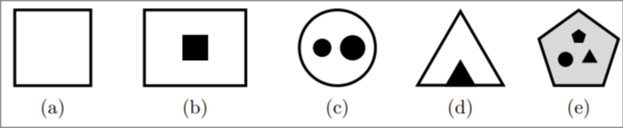
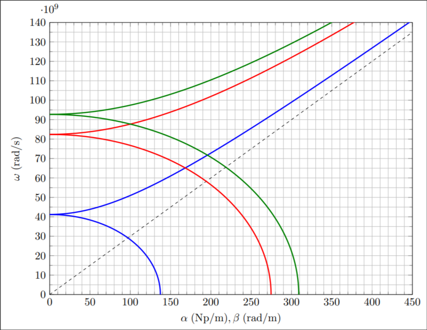

## High Frequency Technologies <!-- omit in toc -->

# Problems on waveguides

---

* [Problem 1](#problem-1)
    * [Question 1.a](#question-1a)
    * [Question 1.b](#question-1b)
    * [Question 1.c](#question-1c)
    * [Question 1.d](#question-1d)
* [Problem 2](#problem-2)
    * [Question 2.a](#question-2a)
    * [Question 2.b](#question-2b)
* [Problem 3](#problem-3)
    * [Question 3.a](#question-3a)
    * [Question 3.b](#question-3b)
* [Problem 4](#problem-4)
    * [Question 4.a](#question-4a)
    * [Question 4.b](#question-4b)
* [Problem 5](#problem-5)
    * [Question 5.a](#question-5a)
    * [Question 5.b](#question-5b)
* [Problem 6](#problem-6)
    * [Question 6.a](#question-6a)
    * [Question 6.b](#question-6b)
* [Problem 7](#problem-7)
    * [Question 7.a](#question-7a)
    * [Question 7.b](#question-7b)
    * [Question 7.c](#question-7c)
    * [Question 7.d](#question-7d)
* [Problem 8](#problem-8)
    * [Question 8.a](#question-8a)
    * [Question 8.b](#question-8b)
    * [Question 8.c](#question-8c)
* [Problem 9](#problem-9)
    * [Question 9.a](#question-9a)
    * [Question 9.b](#question-9b)
    * [Question 9.c](#question-9c)
    * [Question 9.d](#question-9d)
* [Problem 10](#problem-10)
    * [Question 10.a](#question-10a)
    * [Question 10.b](#question-10b)
* [Problem 11](#problem-11)
    * [Question 11.a](#question-11a)
    * [Question 11.b](#question-11b)
    * [Question 11.c](#question-11c)
    * [Question 11.d](#question-11d)
* [Problem 12](#problem-12)
    * [Question 12.a](#question-12a)
    * [Question 12.b](#question-12b)
    * [Question 12.c](#question-12c)

---

## Problem 1

Consider a waveguide with square cross-section of side $a$.

### Question 1.a •

Compute the cutoff frequencies of its modes.

> **Answer**
>
> $$
> \begin{aligned}
>     fₘₙ &= \frac{1}{2\sqrt{μϵ}} \sqrt{\frac{m²}{a²} + \frac{n²}{a²}} \\
>         &= \frac{c₀}{2a\sqrt{ϵ_r}} \sqrt{m² + n²}
> \end{aligned}
> $$

### Question 1.b

Check that there are two dominant modes.

### Question 1.c

Compute the power transmitted by each of the two modes, in terms of the maximum
amplitude of the electric field.

### Question 1.d

Compute the power transmitted by the superposition of both modes.

## Problem 2

A rectangular waveguide has a cross-section with dimensions $a = 86 \text{ mm}$
and $b = 43 \text{ mm}$. Compute:

### Question 2.a

The single-mode bandwidth.

### Question 2.b

The maximum power that the fundamental mode can transmit in the single-mode
band, if the maximum allowable electric field is limited to 30 V/cm.

## Problem 3

Consider an empty cylindrical waveguide, with a fundamental mode that has the
same cutoff frequency than the rectangular waveguide from the previous problem.

### Question 3.a

Compute the radius of the cylindrical waveguide.

### Question 3.b

Compare the single-mode bandwidth of both waveguides.

## Problem 4

Consider a rectangular waveguide with cross-section of dimensions $a × b$.

### Question 4.a

Find the locations in the $x$ axis so that the amplitudes of the components
$H_x$ and $H_z$ of the fundamental mode magnetic field are equal (this means
that the field has circular polarization).

### Question 4.b

Solve the frequency so that the condition is met at $x = a/4$.

## Problem 5

Consider a symmetric stripline transmission line (see figure), where $W$ is the
width of the strip, and $b$ is the separation between the ground plane plates.
The relative permittivity of the dielectric that fills this space is $ε_r$

### Question 5.a

Sort the particular cases in the table in terms of their characteristic
impedances, using the relationships “less than” ($<$) and “approximately equal
to” ($≈$) (Example: $Z^A_0 < Z^C_0 ≈ Z^D_0 < Z^B_0 < Z^E_0$). Reason your
answer.

|            | A   | B    | C    | D    | E    |
| :--------: | --- | ---- | ---- | ---- | ---- |
| Width      | $W$ | $2W$ | $2W$ | $W$  | $3W$ |
| Separation | $b$ | $2b$ | $b$  | $2b$ | $2b$ |

### Question 5.b

If $Z^A_0 = 50 Ω$ and $ε_r = 4.5$, what is the characteristic impedance if the
dielectric is replaced with another one of $ε_r = 9$?

## Problem 6

Consider a microstrip transmission line (see figure), where $W$ is the width of
the strip and $h$ is the thickness of the dielectric substrate, with relative
permittivity $ε_r$.

### Question 6.a

Sort the particular cases in the table in terms of their phase velocities,
using the relationships “less than” ($<$) and “approximately equal to” ($≈$)
(Example: $v^A_p < v^C_p ≈ v^D_p < v^B_p < v^E_p$). Reason your answer.

|           | A   | B    | C    | D    | E    |
| :-------: | --- | ---- | ---- | ---- | ---- |
| Width     | $W$ | $2W$ | $2W$ | $W$  | $3W$ |
| Thickness | $h$ | $2h$ | $h$  | $2h$ | $2h$ |

### Question 6.b

If the dielectric substrate is replaced by another one with higher $ε_r$, will
the phase velocities increase or decrease?

## Problem 7

The diagram below shows the cross-section of a waveguide, where the black lines
represent perfect conductor, and the grey region is certain dielectric with
$ε_r$.

### Question 7.a

What types of modes can propagate?

### Question 7.b

How many TEM modes (if any) are supported?

### Question 7.c

For each TEM mode that is supported, what is the phase velocity?

### Question 7.d

If the dielectric is replaced with another one whose permittivity is double
($ε'_r = 2ε_r$), what are the new phase velocities, in terms of the original
ones?

## Problem 8

The diagram below shows the cross-section of a waveguide, where the black lines
represent perfect conductor, and the white region is empty:

Original waveguide

Also consider two new waveguides with the cross-sections shown below, that are
versions of the original waveguide: one of them is scaled with scale factor
$F$, the other one is filled with certain dielectric of $ε_r$ (represented in
grey).

### Question 8.a

What types of modes can propagate?

### Question 8.b

In the case of the fundamental modes of the original and scaled waveguides,
determine the relationship between their characteristic impedances, and also
their phase velocities.

### Question 8.c

Repeat the question, but comparing the original and the filled waveguides.

## Problem 9

The diagram below shows the cross-section of a waveguide, where the black lines
represent perfect conductor, the white region is empty, and the grey region is
filled with certain dielectric of permittivity $ε_r$. The waveguide is a coaxial
cable that is mainly empty, with a dielectric support for the inner conductor.
ε_r

Answer and reason the following questions:

### Question 9.a

What types of modes can propagate?

### Question 9.b

Indicate two characteristics of the fundamental mode.

### Question 9.c

For the fundamental mode, estimate a lower and a higher bound of the phase
velocity.

### Question 9.d

From the previous result, what happens if $ε_r = 1.01$?

## Problem 10

The diagrams shown below represent the cross-sections of five different
waveguides. Black parts are perfect conductor, grey regions lossless dielectric
of permittivity $ε > ε_0$, while white regions are empty.

Answer the following questions:

### Question 10.a

For each case, indicate and reason which types of modes are supported. If TEM
modes are supported, how many of them?

### Question 10.b

The plots below are three dispersion diagrams. The slope of the dashed line is
the speed of light in vacuum. Indicate which dispersion diagram corresponds to
each cross-section from the previous question, providing justification for your
answer.

## Problem 11

The plot below shows the dispersion diagram of the first three modes supported
by a WR-90 rectangular waveguide.

Using the diagram estimate the following values:

### Question 11.a

Single-mode bandwidth, in GHz.

### Question 11.b

Attenuation and phase constant of the fundamental mode, at 3.18 GHz and 11.9
GHz.

### Question 11.c

Phase velocity and group velocity of the fundamental mode, at 11.9 GHz.

### Question 11.d

Internal dimensions of the WR-90 waveguide cross-section.

## Problem 12

The following figures represent the cross-sections of several waveguides. Black
parts are perfect conductor, grey areas are certain dielectric with relative
permittivity $ε_r = 4$, while white areas are just vacuum. The dimensions are
$a = 25 \text{ mm}$, $b = 12 \text{ mm}$, $c = 2 \text{ mm}$, $d = 0.1 \text{
mm}$, and $e = 1 \text{ mm}$.

Answer the following questions:

### Question 12.a

For each case, indicate the types of modes that are supported, identifying the
fundamental mode, and computing its cutoff frequency.

### Question 12.b

For each case, compute the wavelength of the fundamental mode at $f$ = 2 GHz, if
possible.

### Question 12.c

For each waveguide, sketch the dispersion diagram of the fundamental mode. Make
use of the axis provided, where the dashed line represent the speed of light in
vacuum. Justify your answer.
