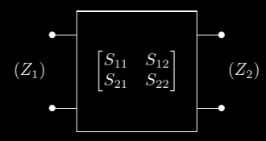

# 2.HFT::4.S-parameters

## $b_i$ and $a_i$ in terms of $V_i$, $I_i$, $Z_i$

***

$$
b_i = \frac{V_i-Z_i I_i}{\sqrt{8Z_i}}
$$

## S-parameters from impedances

***

$$
S_{11} = \frac{Z_{in1} - Z_1}{Z_{in1} + Z_1} \\
S_{22} = \frac{Z_{in2} - Z_2}{Z_{in2} + Z_2} \\
S_{21} = \frac{-2 \sqrt{Z_1 Z_2}}{Z_{in1} + Z_1} \frac{I_2}{I_1} \\
$$

